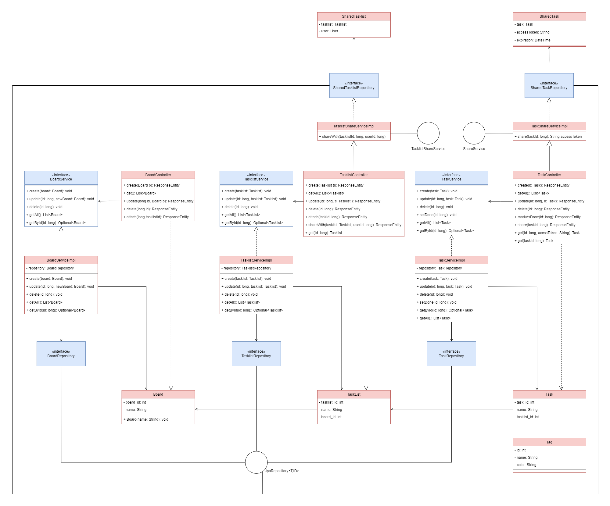

# Class Diagram for TaDoo

  

 

## Description of the Class Diagram

The class diagram of the TaDoo application illustrates the main components of the backend system that enable management of boards, task lists, and tasks.

### 1. Entities

#### **Board**
- **Purpose**: Represents a board in the TaDoo application, which acts as a container for task lists and tasks.
- **Attributes**:
    - `board_id`, `name`
- **Key Methods**:
    - **Constructor**: Initializes a new board with a given name.
- **Use Case**: Boards organize task lists under a specific project or context.

#### **Tasklist**
- **Purpose**: Represents a list of tasks within a board.
- **Attributes**: `tasklist_id`, `name`, `board_id`.
- **Use Case**: Tasklists categorize tasks for better organization (e.g., To-Do, In Progress, Done).

#### **Task**
- **Purpose**: Represents an individual task with attributes like description, due date, and associated labels.
- **Attributes**: `task_id`, `name`, `tasklist_id`.
- **Key Methods**: No explicit methods in the entity class; managed via service layer.
- **Use Case**: Tasks help users manage individual activities.

#### **Tag**
- **Purpose**: Represents labels for categorizing tasks.
- **Attributes**: `id`, `name`,  `color`.
- **Use Case**: Tags help in filtering and organizing tasks.

#### **SharedTask & SharedTasklist**
- **Purpose**: Represents tasks or task lists that are shared among multiple users.
- **Attributes**: Includes user associations and task/tasklist references.
- **Use Case**: Enables collaborative task management across different users.

### 2. Repositories

#### **BoardRepository, TaskRepository, TasklistRepository, SharedTasklistRepository, SharedTaskRepository**
- **Purpose**: Interfaces extending `JpaRepository` to provide CRUD operations on entities.
- **Use Case**: These are the Data Access Layer (DAL) components responsible for communication with the database.

### 3. Services

#### **BoardService & BoardServiceImpl**
- **Purpose**: Provides business logic for managing boards.
- **Key Methods**:
    - **`create(Board board)`**: Adds a new board.
    - **`update(long id, Board newBoard)`**: Updates an existing board by ID.
    - **`delete(long id)`**: Deletes a board by ID.
    - **`getAll()`**: Retrieves all boards.
    - **`getById(long id)`**: Retrieves a board by ID.
- **Use Case**: Encapsulates the logic for handling board-related actions and ensures separation of concerns between the controller and the data layer.

#### **TaskService & TaskServiceImpl**
- **Purpose**: Manages task-related operations.
- **Key Methods**: Similar to `BoardService`, with methods for creating, updating, retrieving, and deleting tasks.
- **Use Case**: Handles all business logic associated with task management.

#### **TasklistService & TasklistServiceImpl**
- **Purpose**: Manages operations related to task lists.
- **Key Methods**: Includes methods for handling task list creation, updates, and deletions.
- **Use Case**: Ensures task lists are managed independently and linked to the appropriate boards.

#### **ShareService, TasklistShareService, TaskShareServiceImpl, TasklistShareServiceImpl**
- **Purpose**: Handles the sharing functionality for tasks and task lists, enabling collaboration.
- **Key Methods**:
    - **`shareTaskWithUser(long taskId, long userId)`**: Shares a task with a specific user.
    - **`shareTasklistWithUser(long tasklistId, long userId)`**: Shares a task list with a specific user.
- **Use Case**: Supports the new feature of sharing tasks and lists, facilitating teamwork.

### 4. Controllers

#### **BoardController**
- **Purpose**: Exposes RESTful APIs for board-related operations.
- **Key Methods**:
    - **`create(Board board)`**: Endpoint to create a new board (`POST /board`).
    - **`get()`**: Endpoint to fetch all boards (`GET /board`).
    - **`update(long id, Board board)`**: Endpoint to update an existing board (`PUT /board/{id}`).
    - **`delete(long id)`**: Endpoint to delete a board (`DELETE /board/{id}`).
- **Use Case**: Acts as the entry point for client requests related to board management.

#### **TaskController & TasklistController**
- **Purpose**: Expose APIs for managing tasks and task lists.
- **Key Methods**:
    - **`create(Task task)`**, **`update(Task task)`**, **`delete(long id)`**, etc.
- **Use Case**: Allow clients to interact with tasks and lists through HTTP endpoints.

