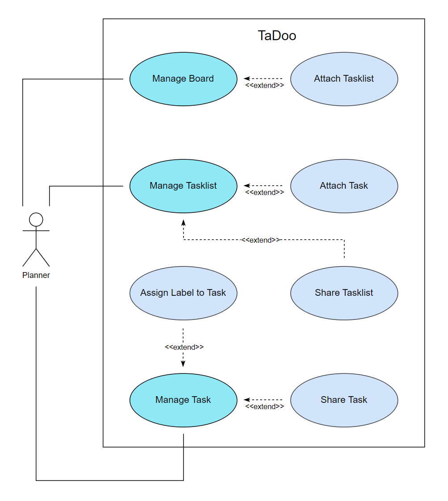

# Use Case Diagram

  

 

## Use Case Descriptions

### Manage Board
- This functionality allows the planner to create, edit, and delete boards. Each board acts as a container for task lists, enabling the user to organize tasks by different projects or categories.

### Attach Tasklist
- Extending the "Manage Board" use case, this feature allows users to add task lists to an existing board, facilitating the grouping of related tasks.

### Manage Tasklist
- The planner can create, edit, or delete task lists within a board. This provides flexibility in structuring tasks under a specific project or category.

### Attach Task
- Extending the "Manage Tasklist" use case, this functionality lets the planner add tasks to task lists, ensuring tasks are organized and accessible under their respective lists.

### Manage Task
- This use case supports adding, editing, marking as complete, or deleting tasks. It forms the core of task management, making it easy for users to update their tasks as needed.

### Assign Label to Task
- This feature extends the "Manage Task" use case. It allows the planner to assign priority or category labels to tasks, helping identify their importance or type quickly.

### Share Tasklist
- This use case enables the user to create a link and share task lists with others, promoting collaboration and shared responsibility in task management.

### Share Task
- Extending "Manage Task", this functionality allows individual tasks to be shared with other users for collaboration or delegation using generated links.
